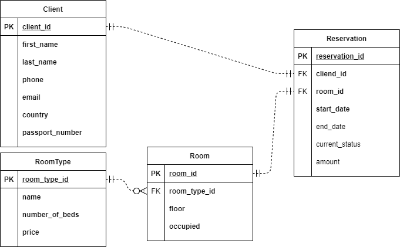

# :tada: ezHotel :tada: 
## *Documentation work in progress*
## WinForms CRM for Hotels
This application has been created by Asanali Bulatov (`w62890`) and Yasmin Kisskova (`w62831`)

- [:tada: ezHotel :tada:](#tada-ezhotel-tada)
  - [*Documentation work in progress*](#documentation-work-in-progress)
  - [WinForms CRM for Hotels](#winforms-crm-for-hotels)
- [Purpose of the app](#purpose-of-the-app)
- [ER - Diagram](#er---diagram)
- [Disclaimer](#disclaimer)
- [Screenshots](#screenshots)
- [Initial SQL script](#initial-sql-script)
- [How to use?](#how-to-use)
- [How this program works?](#how-this-program-works)
- [Sources](#sources)

# Purpose of the app
* A fast and reliable solution
* Compact SQLite database
* Open source and accessibility for everyone

# ER - Diagram


# Disclaimer
This project was created as part of *Programming Languages* course.

# Screenshots 

*Dashboard*


*Manage Clients*


*Create a client*


*Manage Reservations*


*Create a reservation*


*Manage Rooms*


*Create a Room*

# Initial SQL script
[QueryHolder.cs](./ezHotel/ezHotel/QueryHolder.cs)
This file contains the script that creating a database for the application.

# How to use?
1. Download the latest artifact
2. Run an ezHotel.exe
3. The ```mainDB.db``` file will be created automatically
4. Use the dashboard to access different functionality
   
# How this program works?
When you open the ```.exe``` the program will check for database, if there is not database it will be created.

The code:
```
public static string DbName = "mainDB.db";
public static string ConnectionString = "Data Source=" + DbName + ";Version=3;";
/// <summary>
/// The main entry point for the application.
/// </summary>
[STAThread]
static void Main()
{
    if (!File.Exists(DbName))
    {
        SQLiteConnection.CreateFile(DbName);

        using (var connect = new SQLiteConnection(ConnectionString))
        {
            var command = new SQLiteCommand(QueryHolder.InitQuery, connect);
            connect.Open();
            command.ExecuteNonQuery();
            connect.Close();
        }

    }

    Application.EnableVisualStyles();
    Application.SetCompatibleTextRenderingDefault(false);
    Application.Run(new MainForm());
}
```

For safety, when you open another form. The source form is automatically hiding. We did this by this code. By using `using`.

```
private void manageClientsButton_Click(object sender, EventArgs e)
{
    Hide();
    using (ManageClientsForm manageClientsForm = new ManageClientsForm())
        manageClientsForm.ShowDialog();
    Show();
}

private void manageReservationsButton_Click(object sender, EventArgs e)
{
    Hide();
    using (ManageReservationsForm manageReservationsForm = new ManageReservationsForm())
        manageReservationsForm.ShowDialog();
    Show();
}

private void manageRoomsButton_Click(object sender, EventArgs e)
{
    Hide();
    using (ManageRoomsForm manageRoomsForm = new ManageRoomsForm())
        manageRoomsForm.ShowDialog();
    Show();
}
```

What about CRUD? We implemented it by SQL adapter. It's very common to use. Code example:

This code generating Data Grid View. And using SQL.
```
public void GenerateClientTable()
{
    using (var connect = new SQLiteConnection(Program.ConnectionString))
    {
        connect.Open();
        var sqlCommand = new SQLiteCommand("SELECT * FROM Client", connect);
        var sqlReader = sqlCommand.ExecuteReader();
        var clients = new List<Client>();

        // Another way of this

        //var sqlData = new SQLiteDataAdapter("SELECT * FROM Client", connect);
        //var dataTable = new DataTable();
        //sqlData.Fill(dataTable);
        //dataGridView1.DataSource = dataTable;

        if (sqlReader.HasRows)
        {

            while (sqlReader.Read())
            {
                var clientId = Convert.ToInt32(sqlReader["client_id"]);
                var firstName = sqlReader["first_name"].ToString();
                var lastName = sqlReader["last_name"].ToString();
                var phone = sqlReader["phone"].ToString();
                var email = sqlReader["email"].ToString();
                var country = sqlReader["country"].ToString();
                var passportNumber = sqlReader["passport_number"].ToString();

                var client = new Client(clientId, firstName, lastName, phone, email, country, passportNumber);
                clients.Add(client);
            }
        }

        dataGridClient.DataSource = clients;

        connect.Close();
    }
}
```

This code is updating client information.
```
private void updateButton_Click(object sender, EventArgs e)
{
    if (dataGridClient.RowCount > 0 && firstNameText.TextLength > 0 && lastNameText.TextLength > 0 && phoneText.TextLength > 0 
        && passportNumberText.TextLength > 0 && emailText.TextLength > 0 && countryText.TextLength > 0)
    {
        try
        {
            var selectedRow = dataGridClient.SelectedRows[0].DataBoundItem as Client;
            var clientPk = selectedRow.ClientId;

            using (var connect = new SQLiteConnection(Program.ConnectionString))
            {
                var command = new SQLiteCommand($"UPDATE Client SET first_name = \"{firstNameText.Text}\", last_name = \"{lastNameText.Text}\", phone = \"{phoneText.Text}\", email = \"{emailText.Text}\", country = \"{countryText.Text}\", passport_number = \"{passportNumberText.Text}\" WHERE client_id = {clientPk}", connect);
                connect.Open();
                command.ExecuteNonQuery();
                connect.Close();
            }

            GenerateClientTable();
        }
        catch (Exception exception)
        {
            MessageBox.Show($"Error occured: {exception.Message} - {exception.Source}");
            throw;
        }
    }
}
```

# Sources 
Our code is well written. And self-commented code. So here I will post links to files. So you can check code.

[Mainform.cs (Dashboard)](./ezHotel/ezHotel/MainForm.cs)
[ManageClients.cs](./ezHotel/ezHotel/ManageClientsForm.cs)
[Program.cs](./ezHotel/ezHotel/Program.cs)


